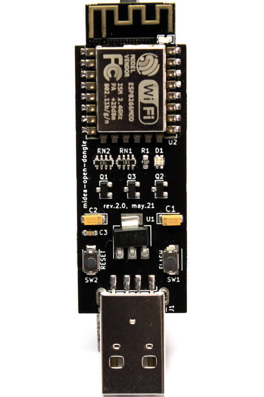
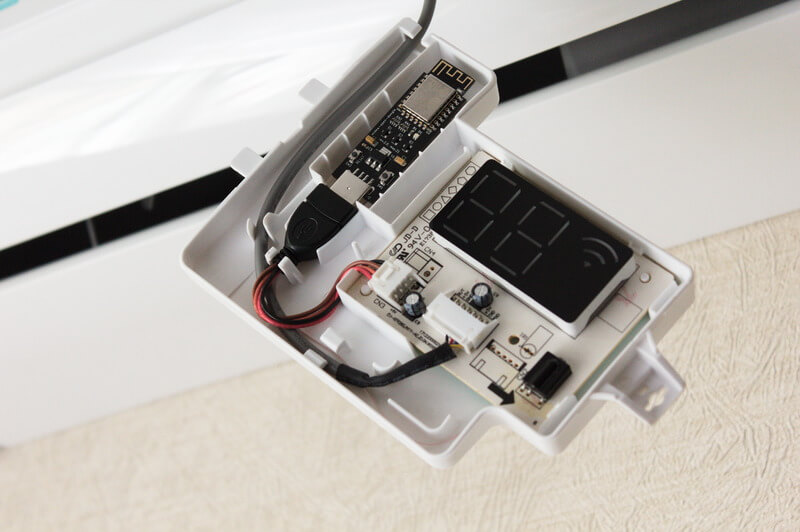

# midea-open-dongle

An open project for a stick for air conditioners controlled by the Midea UART protocol.

A far from complete list of supported brands:
1. [Midea](https://www.midea.com/)
2. [Electrolux](https://www.electrolux.ru/)
3. [Qlima](https://www.qlima.com/)
4. [Artel](https://www.artelgroup.com/)
5. [Carrier](https://www.carrier.com/)
6. [Comfee](http://www.comfee-russia.ru/)
7. [Inventor](https://www.inventorairconditioner.com/)

Board dimensions: 49x20mm, antennas: + 7mm, USB connector: + 15mm, overall: 71x20mm.

Description of files:
* [schematic.pdf](schematic.pdf) - schematic diagram
* [gerber.zip](gerber.zip) - files for making a printed circuit board
* [bom.csv](bom.csv) - bill of materials
* [position.csv](position.csv) - CPL/POS file

The last 3 files can be used to order a stick from the [JLCPCB](https://jlcpcb.com) factory. All that remains is to solder the radio module and the USB connector yourself.

## Imitation of IR remote control commands

Due to the fact that not all capabilities are implemented in the UART protocol (for example, indication control and `FollowMe` feature), it is possible to simulate IR commands by supplying a demodulated signal to pin `GPIO13`.
To do this, connect the `IR_TSOP` pad located on the back of the stick and the output of the IR demodulator on the display board.
The pictures below show an example for a `TSOP1738` IR receiver.

## Frequently asked Questions:
> How can I tell if my air conditioner is supported or not?

*None 100% answer to the question. But there is a high probability of support if your air conditioner has a USB connector, a regular place for a stick, UART is used.*

> What firmware would you recommend?

*Initially, the stick was developed for [ESPHome](https://esphome.io) and [Home Assistant](https://www.home-assistant.io), but it is possible to write your own firmware for your tasks and needs if you have the appropriate skills.*

> Is it possible to purchase a ready-made stick?

*Yes, you can write me to my [Telegram](https://t.me/dudanov) or [e-mail](mailto:sergey.dudanov@gmail.com).*

